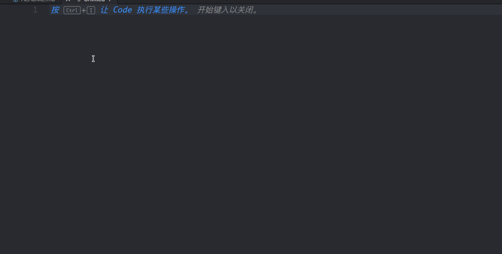
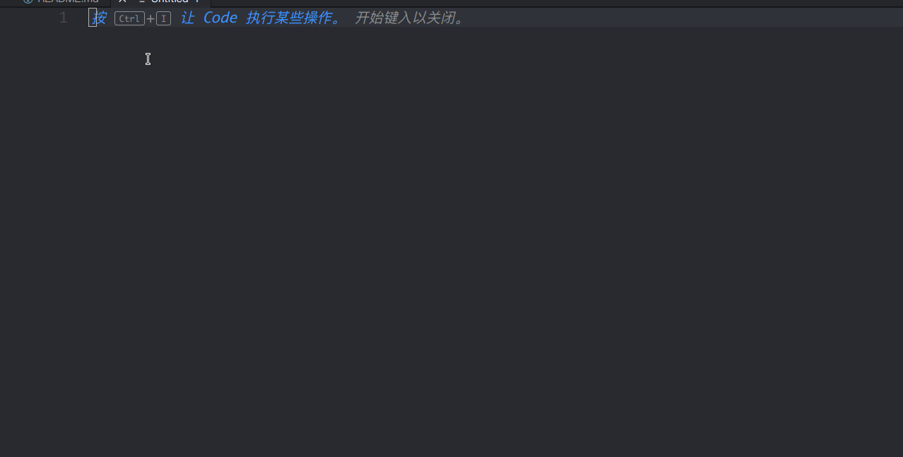
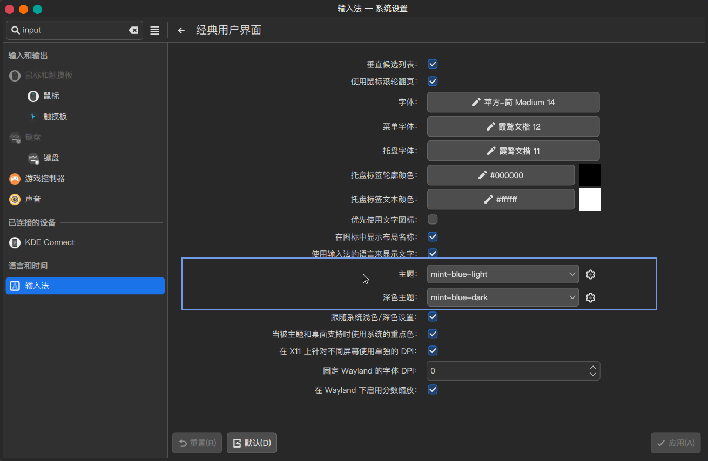

<h1 align="center"><a href="https://github.com/Mintimate/oh-my-rime">薄荷输入法</a>
同款fcitx5皮肤</h1>

### 来源
* [oh-my-rime输入法](https://www.mintimate.cc/)
* [薄荷输入法仓库](https://github.com/Mintimate/oh-my-rime)
* [薄荷输入法小狼毫配置](https://github.com/Mintimate/oh-my-rime/blob/main/weasel.yaml)
* [薄荷输入法鼠须管配置](https://github.com/Mintimate/oh-my-rime/blob/main/symbols.yaml)

### 原效果图


### 效果图

* 黑水鸭


* 蓝水鸭


* 碧月青



* 碧皓青



### 安装

#### 1.源码安装

> 适用所有发行版

```shell
git clone https://github.com/witt-bit/fcitx5-theme-mint.git

# 安装
./install.sh
```

#### 2.AUR安装

> 适用Arch Linux和Manjaro

```shell
yay -S fcitx5-theme-mint
```

### 使用

在**系统设置**-->**输入法**-->**配置附加组件**-->**经典用户界面**-->**主题/深色主题**选择启用


